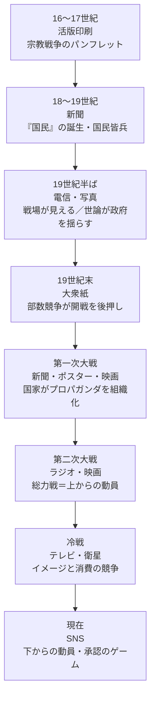

情報と戦争 date: 2026-09-27 related: "[[庭の話を読む]]"

# 情報と戦争

> メディア技術が変わるたびに、「戦争を支持し、参加する人の範囲」が広がり、情報への反応は速くなってきた。 その行き着いた先がSNSであり、宇野常寛は『[[庭の話を読む]]』でそれを「速すぎる」と診断している。

## 全体の流れ

| 時代      | 技術         | 人と情報の関係                                |
| ------- | ---------- | -------------------------------------- |
| 16〜17世紀 | 活版印刷       | パンフレットや風刺版画が宗教対立を煽る。最初の本格的なプロパガンダ戦     |
| 18〜19世紀 | 新聞         | 見知らぬ何百万人が「同じ国民」だと想像できるようになり、国民皆兵が可能になる |
| 19世紀半ば  | 電信・写真      | 遠くの戦場がすぐ伝わり、見えるようになる。世論が政治を動かし始める      |
| 19世紀末   | 大衆紙        | メディアの商売の論理が戦争を煽る                       |
| 第一次大戦   | 新聞・ポスター・映画 | 国家が宣伝を組織的に行う。「世論は作れる」という認識が定着          |
| 第二次大戦   | ラジオ・映画     | 同じ声と同じ映像で、国民全体を同じ物語に束ねる（総力戦）           |
| 冷戦      | テレビ・衛星     | 核があるので直接は戦わず、イメージの戦いになる。人は「他人の物語」を観る側  |
| 現在      | SNS        | 誰もが発信する側。人びとが自分から拡散し、承認を交換する           |

---

## 時代ごとのメモ

### 印刷以前〜近世

- 戦争は王侯貴族と職業軍人・傭兵のもので、民衆が戦争を「支持する」必要はなかった
- 例外は宗教戦争。活版印刷によって、ルター派とカトリックが互いを悪魔化するパンフレットが大量に出回った

### ナポレオン戦争と新聞

- フランス革命期の国民総動員令（1793年）。王のためではなく「国民」として戦う兵士が生まれた
- ベネディクト・アンダーソン『想像の共同体』：国民という感覚を生んだのは新聞（出版資本主義）。同じ日付の同じ記事を国中で読むことが効いた

### 電信と写真：「戦場が見える」

- **クリミア戦争（1853〜56年）**：最初の「メディア戦争」
    - 『タイムズ』の従軍記者ラッセルが電信で英軍の惨状を報じ、世論が怒って内閣が倒れた
    - 写真家ロジャー・フェントンの『死の影の谷』には、砲弾を並べ替えた演出ではないかという議論がある
- **南北戦争（1861〜65年）**：マシュー・ブレイディらが戦場の死体を撮影。ここでも死体を動かして構図を作った例がある
- 📷 **写真は出発点から「記録」であると同時に「演出」でもあった**

### 大衆紙

- **米西戦争（1898年）**：ハーストとピュリツァーのイエロー・ジャーナリズムが開戦の世論を後押しした（「絵を送れ、戦争は用意する」という発言は真偽が疑わしい）
- **日清・日露戦争**：戦況報道で新聞の部数が急増。日露戦争後には、講和条件に怒った民衆が日比谷焼打ち事件を起こした。政府が実情を伏せていたため、熱狂した世論と現実がずれていた

### 第一次世界大戦

- 国家がプロパガンダを組織した（英国の宣伝局、米国のクリール委員会）。「敵の残虐行為」の話が誇張・捏造された
- 戦後、リップマン『世論』（1922年）、バーネイズ『プロパガンダ』（1928年）が書かれた

### 第二次世界大戦：ラジオと映画の総力戦

- 総力戦には「ひとつの物語を、同時に、大量の人に届ける技術」が必要だった
- **ラジオ（声）**：ナチスの国民受信機、ローズヴェルトの炉辺談話、大本営発表、玉音放送
- **映画（映像）**：リーフェンシュタール『意志の勝利』、映画館で流れるニュース映画
- ベンヤミン「複製技術時代の芸術作品」（1936年）：**ファシズムは政治を美学化する。その行き着く先は戦争**

### 冷戦：壁を越える電波

- **ラジオ**：VOA、BBC、RIAS、ラジオ・フリー・ヨーロッパ。東側は妨害電波で対抗し、ソ連が妨害をやめたのは1988年
- **テレビ**：東ドイツでは西ドイツの地上波がそのまま映り、多くの人が毎晩観ていた
- **衛星放送**：家庭で直接受信できるものが広がったのは1980年代後半（Astra衛星は1988年）。影響が大きかったのはむしろ冷戦後
- **意識の変化**
    - チェルノブイリ（1986年）：人びとはまず外国のラジオで事故を知り、体制への不信とグラスノスチが加速した
    - ポーランドの「連帯」運動：RFEが国内の出来事を国内向けに報じ返した
    - ベルリンの壁崩壊（1989年）：シャボウスキーの記者会見を西のテレビが「国境が開いた」と報じ、それを観た市民が検問所に殺到した。**報道が事件を引き起こした**
- ⚠️ **反対の実証研究**：ケルンとハインミュラー「大衆のアヘン」（2009年）
    - 西のテレビが映らないドレスデン周辺（「何も知らない者の谷」）と比べると、西のテレビを観られた地域のほうが体制への満足度が高かった
    - 人びとが観ていたのは主に娯楽番組で、不満を吸収して体制を安定させた
    - → **情報は人を目覚めさせるとは限らない。現状を延命させることもある**
- 湾岸戦争（1991年）：CNNの生中継。「CNN効果」という言葉が生まれた

### 現在：SNSと下からの動員

- 「キーウの幽霊」：架空のパイロット伝説を、人びとが自発的に拡散して広めた
- 情報の力は「正しい事実を届けること」から「欲望に応えること」へ移った（宇野）

---

## プロパガンダとは

**特定の考え方や行動に人びとを導くために、情報を意図的に選び、組み立て、広めること。**

- 嘘とは限らない。問題は「事実かどうか」ではなく「目的があるかどうか」
- 主な手法
    - 見せるものと隠すものを選ぶ
    - 感情（怒り・恐怖・誇り・憐れみ）に訴える
    - 敵をつくる
    - 繰り返す
    - 「みんなそう思っている」という空気をつくる
- 教育や報道は、相手が自分で判断することを前提にする。プロパガンダは、判断の手前で結論を植えつける
- 語源：1622年のカトリック「布教聖省」（Propaganda Fide）。本来は「広める」という中立的な意味で、悪い意味になったのは第一次大戦後
- バーネイズは、評判の悪くなったこの言葉を「PR」と言い換えた。広告・PR・プロパガンダは技術的に地続き
- SNS時代には、受け手自身が拡散に参加する。騙されているというより、「乗ることで世界に関与している実感」を得ている

---

## 『庭の話』との接続

|章|つながり|
|---|---|
|第1章|人びとが求めているのは「正しさ」ではなく「実感」。「キーウの幽霊」に見られる、下からの動員|
|第11章|坂口安吾『戦争と一人の女』の、戦争を「美しい」と感じる女性＝戦争の美学化を、一人の人間の内側の欲望として描き直す|
|全体|20世紀：ラジオと映画が戦争への欲望を国家規模で束ねた（総力戦） 21世紀：SNSがその欲望を、低コストの「関与の実感」として毎日小出しに満たす → プラットフォームは「平時の小さな戦争」であり、庭はその代わりを探す試み|

## 引用・参考文献

### 『庭の話』関連
- 宇野常寛『庭の話』講談社、2024年
- 宇野常寛『遅いインターネット』幻冬舎、2020年（のちに幻冬舎文庫）
- 宇野常寛「【刊行記念特別公開】『庭の話』——序章：プラットフォームから『庭』へ」PLANETS／遅いインターネット  
  https://slowinternet.jp/article/niwanohanashi/
- 宇野常寛「『庭の話』が100倍面白くなる自己解説テキスト」note、2024年12月9日  
  https://note.com/wakusei2nduno/n/n26fcd18b8923
- 坂口安吾「戦争と一人の女」1946年（青空文庫で読める）

### メディア論・思想
- ヴァルター・ベンヤミン「複製技術時代の芸術作品」1936年  
  （『ベンヤミン・コレクション1 近代の意味』浅井健二郎編訳、ちくま学芸文庫 などに収録）
  - 「ファシズムは政治を美学化する」という議論
- ベネディクト・アンダーソン『定本 想像の共同体』白石隆・白石さや訳、書籍工房早山（原著 *Imagined Communities*, 1983年）
  - 新聞（出版資本主義）が「国民」を想像させた、という議論
- マーシャル・マクルーハン『メディア論』栗原裕・河本仲聖訳、みすず書房（原著 *Understanding Media*, 1964年）

### プロパガンダ
- ウォルター・リップマン『世論』上・下、掛川トミ子訳、岩波文庫（原著 *Public Opinion*, 1922年）
- エドワード・バーネイズ『プロパガンダ』中田安彦訳、成甲書房（原著 *Propaganda*, 1928年）

### 冷戦と情報
- Holger Lars Kern & Jens Hainmueller, "Opium for the Masses: How Foreign Media Can Stabilize Authoritarian Regimes," *Political Analysis*, 17(2), 2009
  - 東ドイツの「何も知らない者の谷」（ドレスデン周辺）と西ドイツのテレビについての実証研究

### 戦争写真・報道
- Errol Morris, *Believing Is Seeing: Observations on the Mysteries of Photography*, Penguin Press, 2011
  - フェントン『死の影の谷』の砲弾は演出か、という検証
- James Creelman, *On the Great Highway*, 1901
  - ハーストの「絵を送れ、戦争は用意する」という逸話の出どころ（真偽は疑わしい）

### 書評・解説（ウェブ）
- tokumoto.jp「庭の話（宇野常寛）の書評」 https://tokumoto.jp/2025/01/50901/
- よこはま里山研究所「第130回 宇野常寛『庭の話』」 https://nora-yokohama.org/reading/?p=9546
- 江草令「『庭の話』読んだよ」note https://note.com/exaray/n/n15862d054aac

### 確認状況
- 『庭の話』第1章の内容（キーウの幽霊、Anywhere／Somewhere、関係の絶対性）→ 公開されている序章で確認済み
- 第2〜4章・第11章の内容 → 著者の自己解説と書評にもとづく要約（本文は未確認）
- 「ラジオと映画が総力戦を生んだ」という見立て → 本文の該当ページは未確認
- 年代や歴史上のエピソード → Claudeの知識にもとづく整理なので、引用する前に確認すること